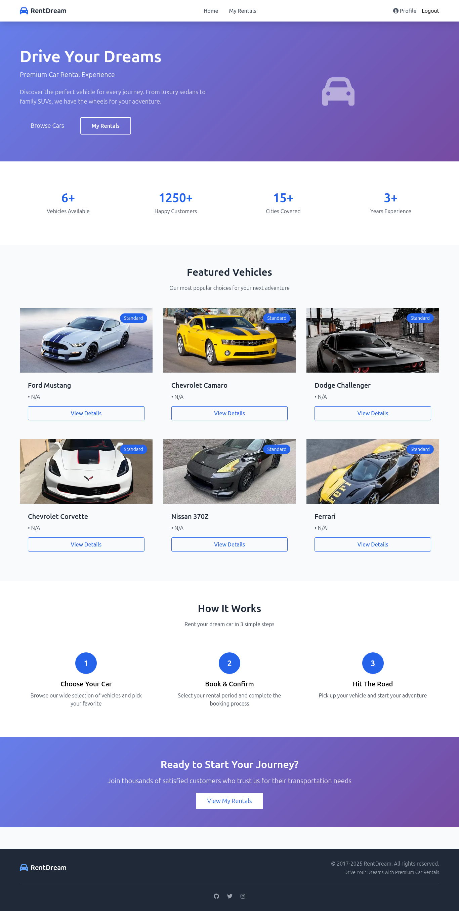
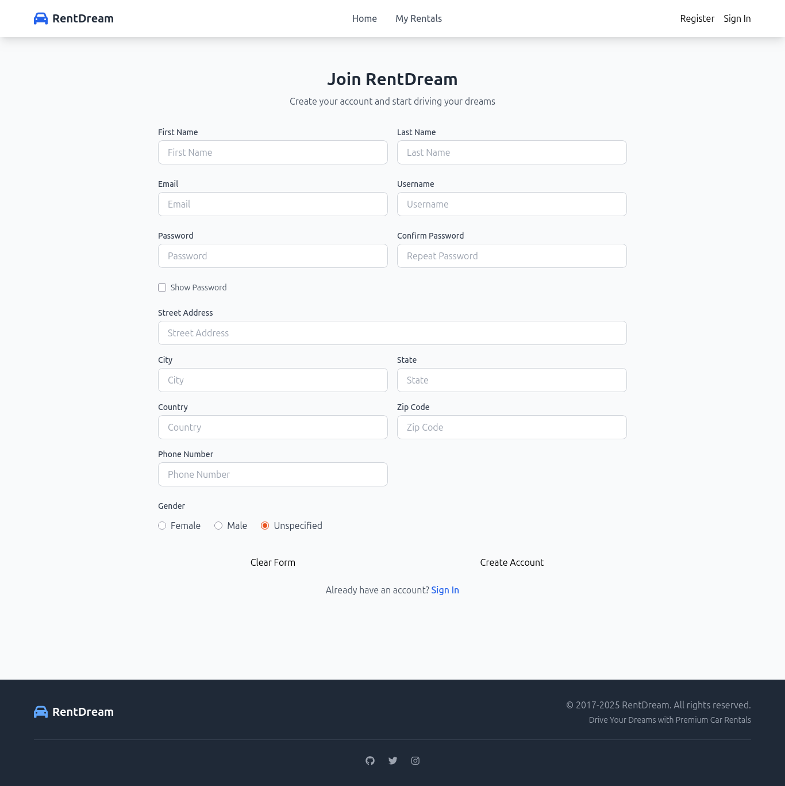
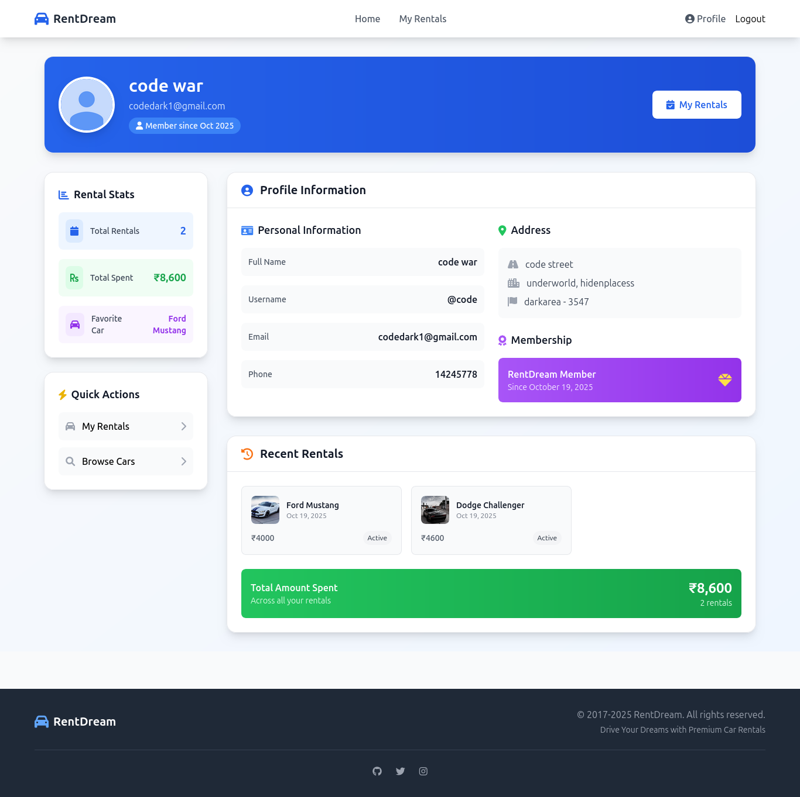
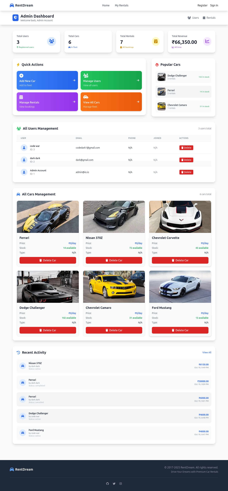
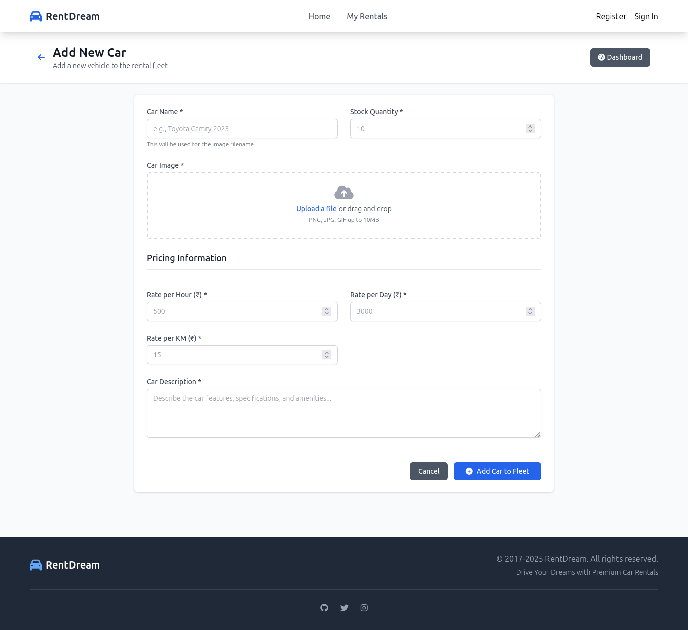

# DreamCars: Premium Car Rental Experience 🚗💨

**DreamCars** is a sleek, full-stack web application designed to provide a premium car rental experience. Built with **PHP** and **MySQL**, it offers secure, user-friendly portals for customers to manage rentals and administrators to efficiently manage the fleet and users.

---

## ✨ Core Features & Screenshots

The application is divided into two main areas: the **Customer Portal** and the **Admin Dashboard**, each packed with features to enhance the user experience and streamline management.

---
### 1️⃣ Customer Portal (User Experience)

The customer-facing side focuses on vehicle browsing, rentals, and profile management.

| Feature          | Description                                                                                                                   |
| :--------------- | :---------------------------------------------------------------------------------------------------------------------------- |
| **Home Page**    | Showcases featured vehicles, key statistics (available cars, happy customers), and a simple 3-step rental process.            |
| **Registration** | A secure, detailed form for creating a user account with personal, contact, and address info.                                 |
| **User Profile** | Personalized dashboard displaying rental stats (Total Rentals, Total Spent), favorite car, personal info, and rental history. |

---

### 2️⃣ Admin Dashboard (Fleet & User Management)

The admin portal provides complete control over the rental business.

| Feature             | Description                                                                                                  |
| :------------------ | :----------------------------------------------------------------------------------------------------------- |
| **Admin Dashboard** | Real-time overview of key metrics: total users, cars, rentals, revenue. Quick action links for common tasks. |
| **Add New Car**     | Form to introduce a new vehicle: name, stock, image, description, and pricing (per hour, per day, per km).   |

---

## 💻 Technology Stack

* **Backend:** PHP – Server-side processing and logic
* **Database:** MySQL – Relational storage for users, cars, and rentals
* **Frontend:** HTML5, CSS3, JavaScript – Responsive and modern UI

---

## 🌟 Future Enhancements

Potential features to make DreamCars even better:

* Online payment integration for seamless bookings
* Dynamic pricing engine based on demand & rental duration
* Customer reviews and ratings for cars
* Advanced analytics for admin dashboard (trends, revenue charts)
* Multi-language support for a global audience

## 📸 Screenshots

## Home 

## Registration

## User Profile

## Admin Dashboard

## Add New Car

---
